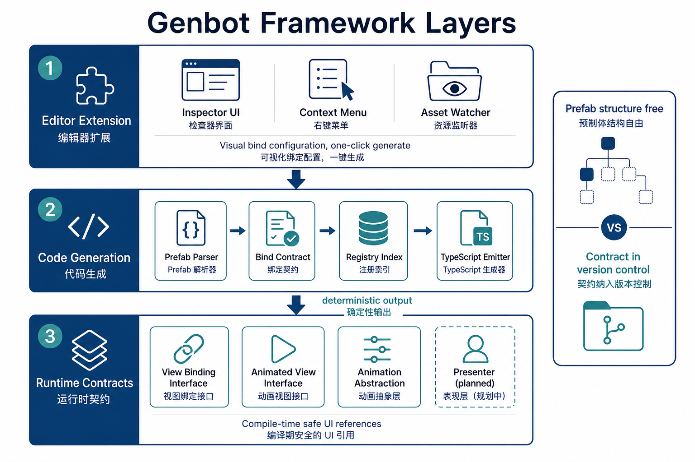
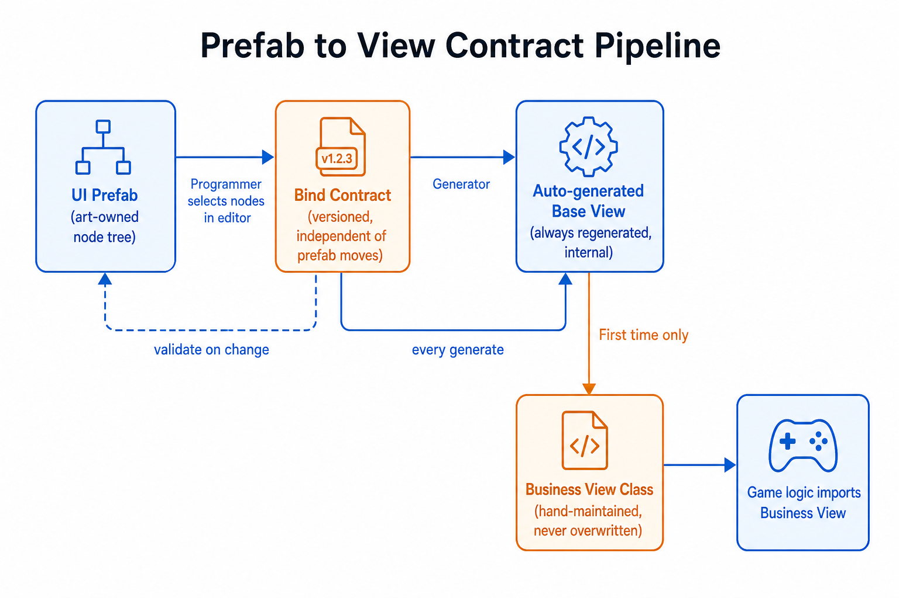
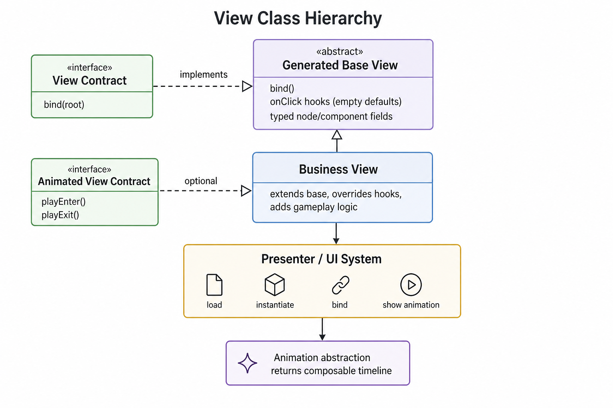
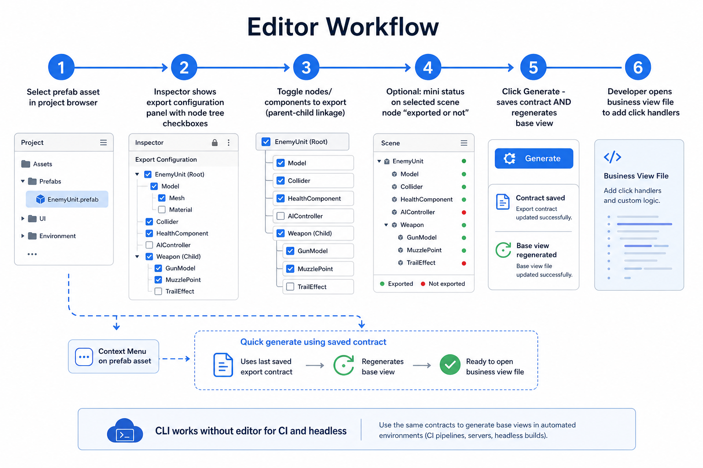
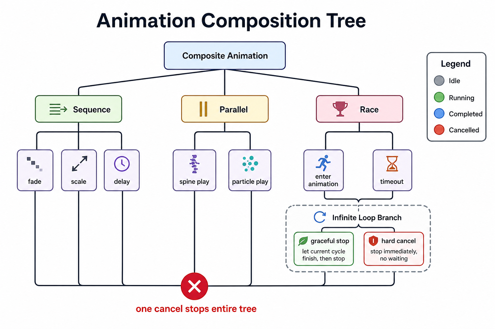
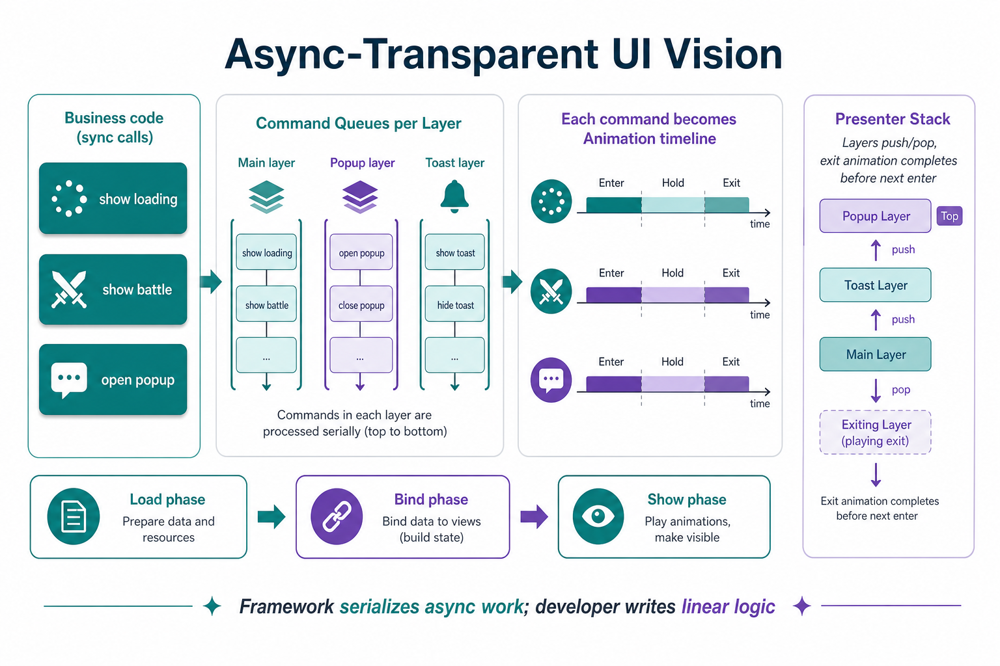

# ViewWeaver 框架原理介绍

> 本文面向需要理解整体设计、但不关心具体实现细节的读者。文中不出现可复制的源码与仓库路径，只讨论**为什么这样设计**、**各层如何协作**、**边界在哪里**。流程与类关系见配图。

---

## 一、这个仓库到底是什么

Genbot 最初只是一个「根据界面预制体自动生成视图绑定代码」的编辑器小工具。随着职责扩展，它正在演化为客户端项目的**新一代基础框架**：把编辑器能力、代码生成、运行时契约、动画体系、以及未来的界面生命周期管理，收拢到同一套设计语言里。

可以把它理解成三层能力叠加，而不是单一脚本：

| 层次 | 职责 | 读者心智 |
|------|------|----------|
| **编辑器层** | 在引擎里可视化勾选要导出的节点与组件，一键生成、校验、监听资源变更 | 「配置契约」 |
| **生成层** | 解析预制体结构，结合契约产出强类型绑定类，并维护全局索引 | 「把契约变成可编译的 API」 |
| **运行时层** | 视图绑定接口、可选的进场退场动画接口、统一动画抽象、未来的 Presenter 栈 | 「业务真正 import 的东西」 |

仓库名称仍叫 Genbot，但讨论架构时应按 **framework** 理解：文档、契约、演进计划都汇聚在本仓；部分运行时代码因编译器扫描约束会放在公共子模块里，属于物理拆分，不是概念分裂。

---

## 二、要解决的核心问题

### 2.1 预制体与程序之间的「契约漂移」

在典型的 Cocos 项目里，美术维护预制体节点树，程序在业务脚本里用字符串或松散引用去找子节点。预制体一改名、一挪层级，编译器不会报错，只有运行时才炸。团队越大，这种**静默断裂**越频繁。

Genbot 的目标是把「程序需要哪些节点、哪些组件」从预制体里**抽出来**，变成可进版本库、可评审、可 diff 的**导出契约**。预制体可以继续自由调整结构，但任何与契约不一致的变更都会在生成或校验阶段暴露。

### 2.2 生成代码与手写代码的边界不清

若整份视图类都由工具覆盖，业务逻辑无处安放；若全靠手写，工具又失去意义。因此采用**双类模型**：

- **自动生成的基础视图**：每次生成都会完整重写，承载字段声明、绑定逻辑、按钮点击的空钩子。业务不应修改这一层。
- **手写的业务视图**：只在首次生成时创建骨架，之后完全由开发者维护。新增按钮时，工具只会在基础层追加空钩子，业务层按需自行 override。

这样既保证绑定与契约始终同步，又保留业务表达的自由度。

### 2.3 导出范围失控

若默认把预制体里所有标签、图片、变换组件都暴露出来，一个中等界面就会产生数百个字段，视图类膨胀到不可维护。因此默认策略收紧为**以可点击控件为触发点**：只有挂了按钮（含继承按钮的自定义脚本）的节点才进入默认导出集，且默认只暴露按钮组件本身，不把同节点上的辅助脚本一并导出。需要更多引用时，在编辑器里显式勾选即可——树始终是完整的，默认勾选只是基线。

### 2.4 动画与 UI 生命周期的碎片化

项目里同时存在补间、序列帧、Spine、粒子、定时器、自定义抖动工具等，取消方式各自为政，编排靠「等待 + 再等待」串起来，节点销毁后动画仍在改属性。框架在运行时侧用**统一动画抽象**回应这些问题，并与视图契约、未来的 Presenter 层对齐。下文第四节展开。

---

## 三、预制体到视图契约：主流程

整体数据流可以概括为：**预制体（美术所有）→ 导出契约（程序所有、进 Git）→ 自动生成的基础视图 → 手写的业务视图**。

### 3.1 各阶段在做什么

**预制体**  
节点层级、组件挂载由美术维护。工具不限制美术如何组织，只在生成时读取当前结构。

**导出契约**  
程序员在编辑器（或命令行）里决定：哪些节点要暴露、暴露节点引用还是只暴露组件、组件类型如何映射到 TypeScript 类型。契约与预制体解耦——预制体移动、重命名时，只需更新全局索引里记录的预制体位置，生成产物目录不必跟着搬。

**自动生成的基础视图**  
根据契约输出强类型字段、绑定方法、按钮点击钩子及事件注册。每次生成都覆盖，保证与契约一致。

**手写的业务视图**  
继承基础视图，实现关心的点击逻辑、生命周期、以及可选的进场退场动画。工具不会覆盖此文件。

### 3.2 全局索引的作用

所有生成产物按「界面名称」扁平归档，而不是散落在预制体原来的资源目录里。一份全局索引维护「哪个预制体对应哪套生成物」。好处是：业务侧的 import 路径稳定；预制体在资源树里怎么挪，只改索引一行，业务代码零改动。

### 3.3 命令行与编辑器双入口

生成核心是无 IO 副作用的纯流程，CLI、编辑器扩展、单元测试共用同一套逻辑。CI 或无引擎环境也能跑生成与校验；有引擎时则在 Inspector 里提供勾选 UI、节点级迷你状态、右键快捷生成等体验。

---

## 四、类与契约关系

### 4.1 视图绑定契约

最小约定：业务视图必须能把逻辑挂到预制体根节点上，并完成子节点、组件引用的解析。自动生成的基础视图**实现**这一契约；业务视图通过继承自动满足。

### 4.2 可动画视图契约（可选）

需要进场、退场表现的界面，可额外实现「播放进入动画 / 播放离开动画」。设计上，这两类方法应返回**可组合、可取消的动画对象**，而不是裸 Promise，这样上层 Presenter 才能做超时赛跑、串行编排、统一 cancel。当前部分历史接口仍返回 Promise，属于过渡态，长期会收敛到动画抽象。

### 4.3 与 Presenter / UI 系统的关系

Presenter（或等价的 UI 系统）负责：加载预制体、实例化、挂载业务视图组件、调用绑定、再触发显示流程。视图层只管「节点怎么连、怎么动」；Presenter 管「何时加载、何时上屏、层与层之间谁先谁后」。二者通过契约解耦，避免把加载逻辑写进视图类。

---

## 五、编辑器侧工作流

推荐主路径是：**选中预制体资源 → 在 Inspector 专用区段里勾选导出项 → 一次操作同时保存契约并生成基础视图 → 在手写业务视图里补逻辑**。

辅助路径包括：在场景里选中某个 UI 节点时，底部显示是否已纳入导出、一键加入契约；资源右键用已保存契约快速生成；菜单里全量重生、全量校验（只读检查、不写盘）。

校验与监听（规划中完善）会在预制体保存后对比契约，提示新增/删除/重名的节点，减少静默漂移。

---

## 六、动画子系统原理

动画库是框架的运行时支柱之一，目标是用**一种心智模型**覆盖项目里所有「会随时间变化」的行为。

### 6.1 设计哲学（五条）

1. **一切动画都是同一类对象**  
   不论补间、Spine、粒子还是纯延时，都有开始与结束、都能被中断、都能再被组合成更大的时间结构。

2. **编排是一等公民**  
   串行、并行、赛跑、有限循环、无限循环、延时、副作用调用等，都返回同一种动画对象，可嵌套成树。对整棵树调用一次取消，子节点全部停止。

3. **取消是默认能力**  
   不再在业务里散落「停止某节点全部补间」「清定时器」等调用。节点销毁时，绑在其上的动画应自动取消，避免预制体已销毁仍在改属性。

4. **有限与无限动画统一**  
   加载圈、待机呼吸等「不会自己结束」的动画，用元信息标记为无限；需要停时可选「礼貌停」（例如转完一整圈再停）与「硬取消」。

5. **显式但默认可用**  
   播放幂等、可重播、子动画在组合前自动重置等，减少误用；但业务日常只需「播放 / 取消」。

### 6.2 组合树与取消传播

业务进场动画往往是：淡入与缩放并行 → 再延时 → 再播 Spine。在框架里这是一棵组合树，根节点一次 `cancel` 即可打断整段流程。这与视图契约里「进场方法应返回可组合动画」的设计意图一致。

### 6.3 与旧实践的对比

| 旧习惯 | 框架取向 |
|--------|----------|
| 多种 API 混用 | 单一动画接口 |
| 取消逻辑分散 | 统一 cancel + 节点销毁挂钩 |
| `await` 逐步拼接 | 声明式组合算子 |
| 动画与节点生命周期脱节 | 默认自动随节点销毁而取消 |

实施分阶段：先落地核心契约与组合算子，再逐步包装补间原语、节点级便捷方法、引擎内置系统（动画状态机、Spine、粒子）、遗留工具适配等。

---

## 七、UI 加载与长期愿景

对现有项目的扫描表明，当前 UI 体系常见痛点包括：多个界面同时 `show` 时加载顺序不确定、缺少真正的界面栈语义、淡入淡出与「显示钩子」混在一个方法里、Widget 对齐与补间抢同一变换通道、实例一挂上树就触发引擎生命周期导致「未准备好却已可见」等。

### 7.1 三阶段分离（方向）

长期希望把 **加载 → 绑定 → 上屏** 拆成显式阶段：资源未就绪时不实例化；实例化后先绑定但不显示；上屏时再走进场动画。临时方案包括「绑定前先隐藏节点」，根因仍要靠 Presenter 与契约层一起收敛。

### 7.2 界面栈与层队列

Presenter 层引入 push/pop：切换界面时，上一层退场动画结束后再让下一层进场，避免叠层闪烁。不同 UI 层（主界面、弹窗、Toast）各有命令队列，层内串行、层间可并行。

### 7.3 「逻辑上不同步等待」的 async-transparent API

愿景是：业务代码以**同步调用**书写（连续调用多次 show、popup），框架内部把每次调用翻译成一段动画时间线，按队列顺序执行；开发者不必在业务层手写大量 `await`。每条命令最终仍落在统一动画抽象上，由调度器逐个 `play`，支持取消与超时赛跑。

### 7.4 显示钩子与动画钩子分离

「界面要被显示 / 隐藏」的轻量同步钩子，与「播放进场 / 退场动画」的异步能力分开：先触发同步钩子做轻量初始化，再播进场；退场则先播完动画，再触发隐藏钩子并销毁。避免一个 `fadeIn` 方法同时承担动画、事件、扩展点三种职责。

---

## 八、跨仓库与文档策略

物理上，编辑器扩展与框架设计文档在本仓；部分运行时代码必须在公共子模块的编译扫描路径下；业务预制体与生成物落在外层游戏项目。设计文档以本仓为**单一真源**，公共模块内可保留镜像方便就地阅读，变更时需两边同步，避免漂移。

---

## 九、演进阶段（概念）

| 阶段 | 主题 | 状态概念 |
|------|------|----------|
| CLI 雏形 | 解析预制体、默认契约、生成基础视图、端到端验证 | 已完成 |
| 编辑器集成 | 菜单、索引、构建管线、资源监听 | 进行中 |
| Inspector 注入 | 预制体与节点级导出 UI，契约可内存传入生成 | 已完成 |
| 自定义脚本识别 | 引擎 UUID 与 TypeScript 类名、import 形式解析 | 已完成 |
| 工作流打磨 | 保存后差异提示、冲突高亮、错误面板 | 计划中 |
| 动画 V1 | 契约 + 组合算子 + 无限动画 | 已完成 |
| 动画后续 | 补间原语、节点糖、系统包装、遗留适配、测试 | 计划中 |
| 框架 V2 | Presenter 栈、三阶段上屏、契约签名返回动画对象、async-transparent | 长期 |

---

## 十、设计决策摘要

- **契约与预制体分离**：换皮、挪节点不 silent break，靠校验与生成暴露问题。  
- **双类生成**：基础层永远跟工具走，业务层永远跟人走。  
- **默认少导出**：把视图 API 控制在「按钮与关键引用」量级，需要再加。  
- **扁平生成物 + 全局索引**：稳定 import，解耦资源树变动。  
- **动画统一抽象**：为编排、取消、生命周期打底，服务 Presenter 长期愿景。  
- **不做过度范围**：例如第一版不绑复杂转轴重构、不做可视化时间轴编辑器，先收敛 API 与可取消语义。

---

## 十一、读者可按角色阅读

| 角色 | 建议重点 |
|------|----------|
| 程序 | 第三节契约流、第四节类关系、第五节编辑器流 |
| 技术负责人 | 第一节定位、第七节长期愿景、第九节演进 |
| 美术 / 策划 | 第二节 2.1（预制体自由 + 契约校验）、第五节勾选导出 |
| 做动画 / 交互 | 第六节动画哲学、第七节钩子与动画分离 |

---

## 配图索引

| 图 | 说明 |
|----|------|
| [framework-layers.png](./images/framework-layers.png) | 编辑器 / 生成 / 运行时三层 |
| [prefab-contract-flow.png](./images/prefab-contract-flow.png) | 预制体 → 契约 → 双类视图 |
| [view-class-relationship.png](./images/view-class-relationship.png) | 视图类与契约、Presenter 关系 |
| [editor-workflow.png](./images/editor-workflow.png) | 编辑器推荐工作流 |
| [animation-composition-tree.png](./images/animation-composition-tree.png) | 动画组合树与取消 |
| [async-transparent-vision.png](./images/async-transparent-vision.png) | 异步透明 UI 与界面栈愿景 |

---

*文档版本：与仓库设计文档同步整理；若实现细节与本文冲突，以仓库内专项设计文档为准。*
